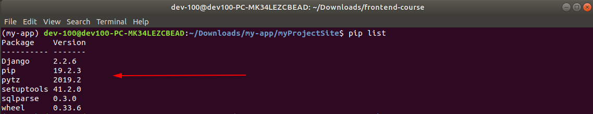
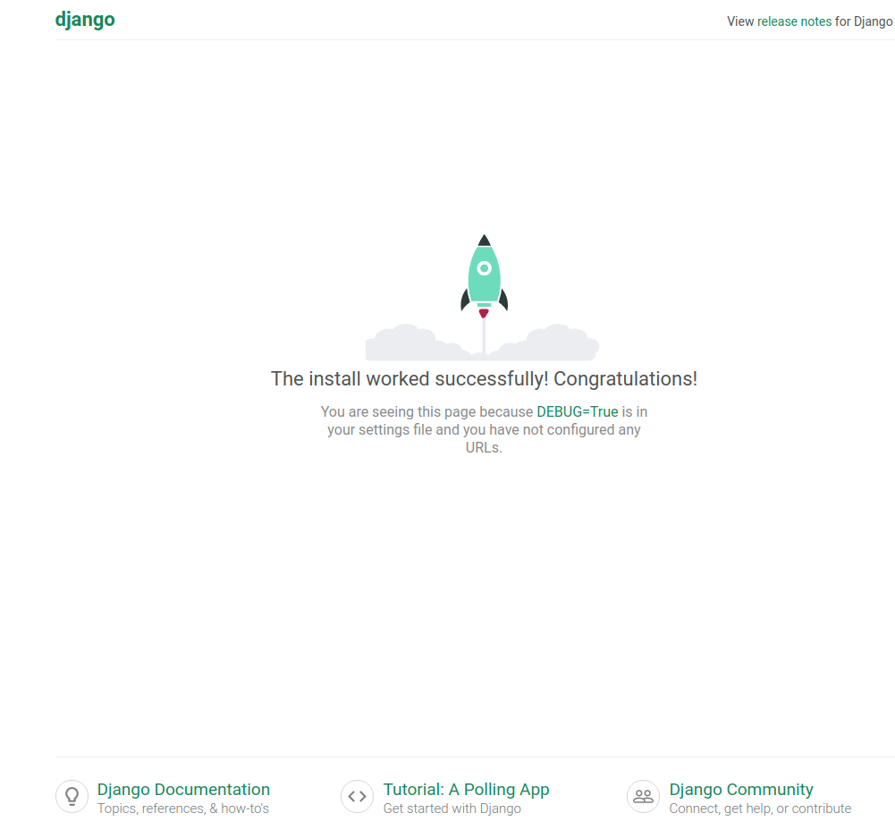
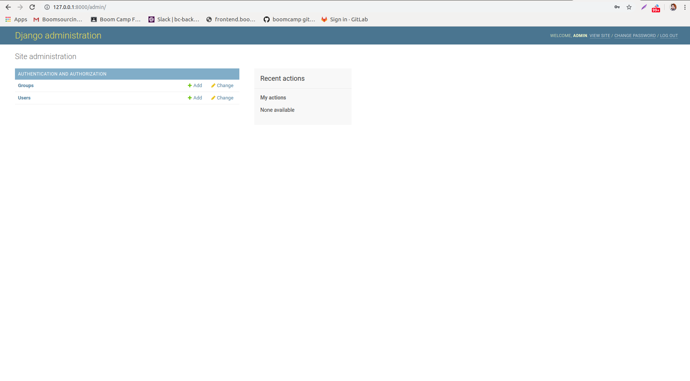

# Basic environment set-up.

- Changing python2 to python3 vice versa.
- Installing python pip and pipenv.
- Setting up basic environment with pipenv, python3 and django-admin.
- Generating starter project using django-admin.
- Running basic migration with SQLite.
- Creating a super user.

## Changing python2 to python3 vice versa.

1. We need to check first available versions of python.

```
ls /usr/bin/python*
```

It will display all available python version's installed in your computer like example 

```
dev-mentor@devmentor-PC-MK34LEZCBEAD:~$ ls /usr/bin/python*
/usr/bin/python  /usr/bin/python2  /usr/bin/python2.7  /usr/bin/python3  /usr/bin/python3.6  /usr/bin/python3.6m  /usr/bin/python3m

```
if havent installed python 3 [Installation python 3](https://docs.python-guide.org/starting/install3/linux/).

2. Next edit `./bashrc` using nano editor.

```
sudo nano ~/.bashrc
```

3. Set alias for `python` and point the version you may want to set as default in this case `python3`.

```
alias python='/usr/bin/python3'
```

3. Reload the `.bashrc`.

```
source ~/.bashrc
```

3. Finally we can now check the version.

```
dev-mentor@devmentor-PC-MK34LEZCBEAD:~$ python --version
Python 3.6.8
```


## Installing python pip and pipenv.

**Pip** = is a package manager for Python.

[What is Pip](https://realpython.com/what-is-pip/)

Installation:

```
sudo apt install python3-pip
#python2: sudo apt install python-pip
```

Note: pip3 is only available for 3.7.4^ versions you can find installation procedure here : [Install-python-3-7-on-ubuntu-18-04](https://linuxize.com/post/how-to-install-python-3-7-on-ubuntu-18-04/).

**Pipenv** = is a tool that aims to bring the best of all packaging worlds (bundler, composer, npm, cargo, yarn, etc.)

[Pipenv](https://pypi.org/project/pipenv/)

```
sudo pip3 install pipenv
#python2: sudo pip install pipenv
```

You should now successfully installed pip3 and pipenv. 

```
dev-mentor@devmentor-PC-MK34LEZCBEAD:~$ pip3 --version
pip 9.0.1 from /usr/lib/python3/dist-packages (python 3.6)
dev-mentor@devmentor-PC-MK34LEZCBEAD:~$ pipenv --version
pipenv, version 2018.11.26
```

## Setting up basic environment with pipenv, python3 and django-admin.

What is **django-admin** = is a ready-to-use user interface for administrative activities. We all know how an admin interface is important for a web project. Django automatically generates admin UI based on your project models.[Tutorialspoint](https://www.tutorialspoint.com/django/django_admin_interface.htm).

[Read more: Django 2.2](https://docs.djangoproject.com/en/2.2/ref/contrib/admin/)

1. First we need to create folder for our project as a container.

```
mkdir my-app && cd my-app
```

2. We also need to create virtual environment using `pipenv`.

```
pipenv --three
```

3. Create virtual environment using specific version of python.

```
pipenv --python 3.6
```

4. Install latest version of django `https://www.djangoproject.com/download/`.

```
pipenv install Django==2.2.6
```

5. Last is activate our virtual environment.

```
pipenv shell
```

Ouput:

```
(my-app) dev-100@dev100-PC-MK34LEZCBEAD:~/Downloads/my-app$
Pipfile  Pipfile.lock
```

**(my-app)** = The active virtual environment.

**Pipfile** =  Handles the virtual environment packages and libraries.

What does **Pipfile** looks like?:

```
[[source]]
[[source]]
name = "pypi"
url = "https://pypi.org/simple"
verify_ssl = true

[dev-packages]

[packages]
django = "==2.2.6"

[requires]
python_version = "3.6"
```

Example of package installed in `(my-app)` environment, we can check it by typing `pip list`:





## Generating starter project using django-admin.

6. We can check django version.

```
django-admin --version
```

7. Initialize django project called `sample`.

```
django-admin startproject sample
```

8. Next change directory to our created project folder.

```
cd sample
```

9. We can now run our application using `python3`.

```
python3 manage.py runserver
```

Output:

```
(my-app) dev-100@dev100-PC-MK34LEZCBEAD:~/Downloads/my-app$ python3 manage.py runserver
Performing system checks...

System check identified no issues (0 silenced).

You have 13 unapplied migration(s). Your project may not work properly until you apply the migrations for app(s): admin, auth, contenttypes, sessions.
Run 'python manage.py migrate' to apply them.

October 04, 2019 - 06:20:18
Django version 1.11.25, using settings 'test_project.settings'
Starting development server at http://127.0.0.1:8000/
Quit the server with CONTROL-C.
```


### Django default welcome page

Host: `http://127.0.0.1:8000/`



`ctrl+d` = Will exit (my-app) virtual environment.

`ctrl+c` = Quit server.


## Running basic migration with SQLite.

By default, the configuration uses *SQLite*, you can type `python3 manage.py migrate` to create tables, the output will be:

```
(my-app) dev-100@dev100-PC-MK34LEZCBEAD:~/Downloads/my-app/sample$ python3 manage.py migrate
Operations to perform:
  Apply all migrations: admin, auth, contenttypes, sessions
Running migrations:
  Applying contenttypes.0001_initial... OK
  Applying auth.0001_initial... OK
  Applying admin.0001_initial... OK
  Applying admin.0002_logentry_remove_auto_add... OK
  Applying admin.0003_logentry_add_action_flag_choices... OK
  Applying contenttypes.0002_remove_content_type_name... OK
  Applying auth.0002_alter_permission_name_max_length... OK
  Applying auth.0003_alter_user_email_max_length... OK
  Applying auth.0004_alter_user_username_opts... OK
  Applying auth.0005_alter_user_last_login_null... OK
  Applying auth.0006_require_contenttypes_0002... OK
  Applying auth.0007_alter_validators_add_error_messages... OK
  Applying auth.0008_alter_user_username_max_length... OK
  Applying auth.0009_alter_user_last_name_max_length... OK
  Applying auth.0010_alter_group_name_max_length... OK
  Applying auth.0011_update_proxy_permissions... OK
  Applying sessions.0001_initial... OK
(my-app) dev-100@dev100-PC-MK34LEZCBEAD:~/Downloads/my-app/sample$ 
```

### Creating a super user.

1. After a successfull migration, you may want to create superuser.

```
python3 manage.py createsuperuser
```

It will ask basic details for superuser account.

```
(my-app) dev-100@dev100-PC-MK34LEZCBEAD:~/Downloads/my-app/sample$ python3 manage.py createsuperuser
Username (leave blank to use 'dev-100'): admin
Email address: jino.lacson@boom.camp
Password: 
Password (again): 
Superuser created successfully.
```

2. After that serve the application folder.

```
python3 manage.py runserver
```

3. Next navigate to admin dashboard, you should now able to login as superuser account.

```
http://127.0.0.1:8000/admin #http://127.0.0.1:8000/admin/login/?next=/admin/
```

### Super admin panel after successfull logged in and migration:




# Done !

